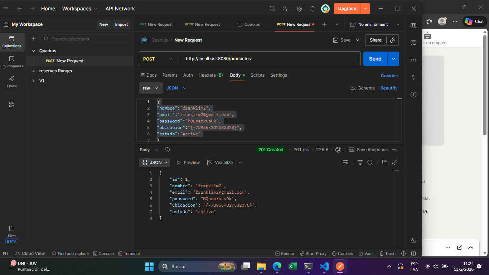
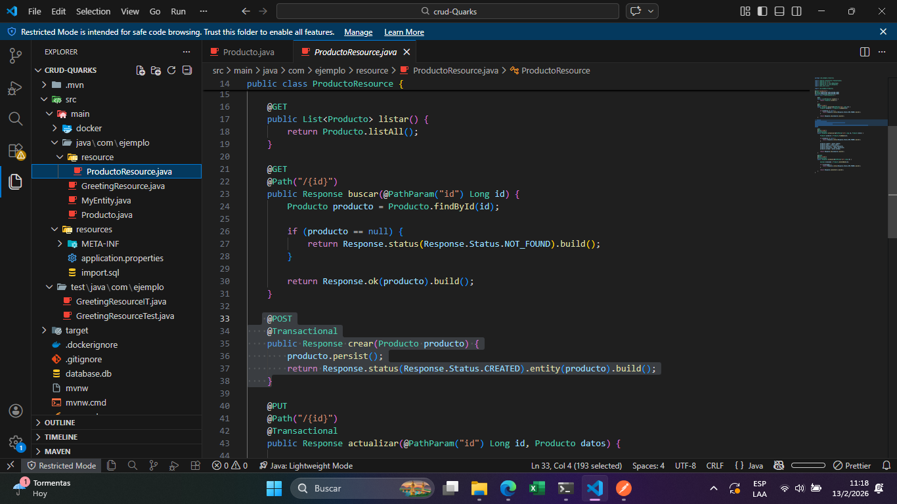

# 🚀 crud-Quarks


## 📋 Descripción

**crud-Quarks** es una aplicación CRUD (Crear, Leer, Actualizar, Eliminar) desarrollada con **Quarkus**, el framework Java nativo de Kubernetes que permite crear aplicaciones cloud-native con un rendimiento excepcional y un tiempo de inicio ultrarrápido.

Este proyecto implementa operaciones CRUD utilizando Hibernate ORM con Panache para la capa de persistencia y REST Jackson para la serialización JSON, proporcionando una API RESTful completa y eficiente.

## Postman

## ✨ Características

- ✅ API RESTful para operaciones CRUD
- ✅ Persistencia con Hibernate ORM y Panache
- ✅ Serialización JSON con Jackson
- ✅ Modo de desarrollo con recarga en caliente
- ✅ Empaquetado como JAR tradicional o über-jar
- ✅ Compilación nativa para rendimiento óptimo
- ✅ Dev UI para monitoreo y pruebas


## 🛠️ Tecnologías Utilizadas

- **Quarkus** - Framework principal
- **Java** - Lenguaje de programación
- **Hibernate ORM con Panache** - Capa de persistencia
- **REST Jackson** - Serialización JSON
- **Maven** - Gestión de dependencias

## 👨‍💻 Creador

**Franklim de Jesús Muñoz**
##Postman

## 🚦 Requisitos Previos

- Java 11 o superior
- Maven 3.8.1 o superior
- GraalVM (opcional, para compilación nativa)
- Docker (opcional, para compilación nativa en contenedor)

## 📦 Instalación y Ejecución

### Modo Desarrollo

```shell script
./mvnw compile quarkus:dev
